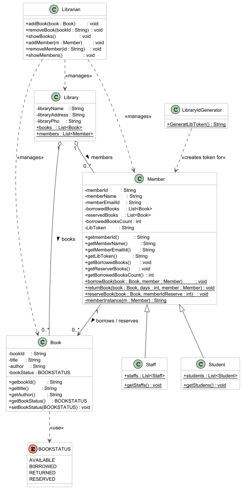

<<<<<<< HEAD
# 📚 Library Management System

A Java-based Library Management System developed to practice Object-Oriented Programming (OOP), Low Level Design (LLD), Collections Framework, and real-world system simulation.

This project simulates a real library where users can manage books, register members, and perform operations like borrow, return, and reserve books.

---

## 🚀 Features

- Show Books in Library
- Show Library Members
- Show Students Members
- Show Staff Members
- Register Member
- Sign out Member
- Borrow Book
- Return Book
- Reserve Book
- Console-Based Menu System

---

## 🛠️ Technologies Used

- Java
- Object-Oriented Programming (OOP)
- Collections Framework
- Low Level Design (LLD)
- IntelliJ IDEA

---

## 🧠 Concepts Implemented

### OOP Concepts
- Encapsulation
- Abstraction
- Inheritance
- Polymorphism

### Java Concepts
- ArrayList / List
- Enums
- Switch Case
- Exception Handling
- Iteration (Loops)

### Design Principles
- Modular Design
- Separation of Concerns
- Reusable Components

---

## 📂 Class Diagram

=======
# Library-Manangement-System
The Library Management System is a simple Java console application to manage library books and members. It allows users to view books, register members, and perform operations like borrow, return, and reserve books using a menu-based system. The project is built using Java and OOP concepts to simulate basic library operations.
>>>>>>> d1163f16af16e781222e562c03dc531d39b1780e
